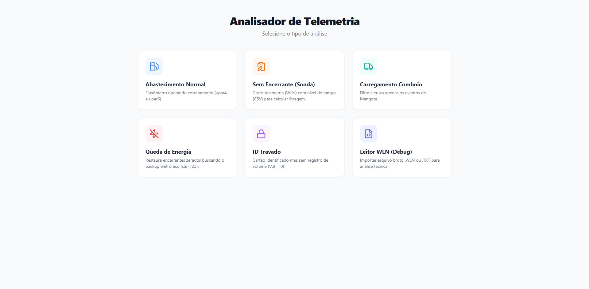
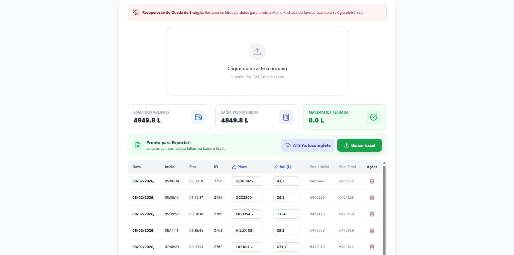
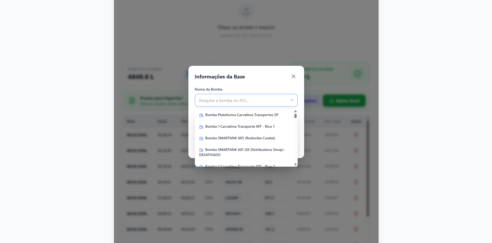
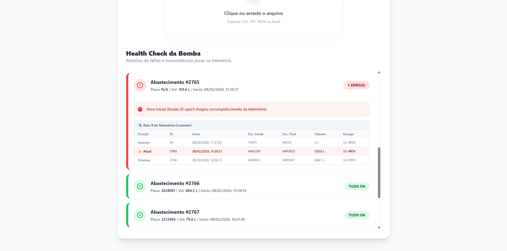

# ⛽ Analisador de Telemetria e Conciliação de Frota

Um sistema corporativo *Serverless* desenvolvido para auditar, conciliar e recuperar dados de telemetria de bombas de combustível (Equipamentos Galileosky) através do cruzamento de logs e integração com API GraphQL.


---

## 🎯 O Problema que este software resolve

Em operações de abastecimento de grande escala, falhas de hardware (como quedas de energia) e "travamentos" de ID na placa de telemetria prejudicam os registros de dados de litragem, o que afeta diretamente o faturamento. O método tradicional de recuperação exigia o cruzamento manual de milhares de linhas de log (arquivos `.wln` e `.csv`), um processo lento e sujeito a erro humano.

Este sistema **automatiza 100% da auditoria matemática**, restaurando abastecimentos perdidos, filtrando ruídos de rede (ecos), sincronizando dados de veículos diretamente do banco de dados (ATS) e gerando planilhas prontas para importação financeira.

---

## ✨ Funcionalidades e Engenharia do Sistema

### 🧮 Motor de Malha Fechada e Auditoria
* **Painel de Auditoria Dinâmico:** Calcula em tempo real a diferença entre a "Soma dos Volumes" apontados e a saída mecânica real ("Saída pelo Medidor"). O sistema acusa divergências visuais se a matemática da bomba não fechar.
* **Recálculo Inteligente:** Uma "Lixeira" funcional permite excluir leituras falsas da tabela, recalculando automaticamente a cascata de Encerrantes (Inicial e Final) dos próximos abastecimentos.

### ⚡ Algoritmo de "Corrente Contínua" (Recuperação de Energia)
* Quando uma bomba sofre queda de tensão no meio de um abastecimento, o registro oficial é perdido. O sistema varre o backup eletrônico (`can_r23`) nos milissegundos exatos do evento do abastecimento para costurar os "buracos" de dados, unindo o Fim do Abastecimento A com o Início do Abastecimento B, recuperando 100% da volumetria.

### 📡 Integração GraphQL e Tradução Automática (ATS)
* **Autocomplete Mágico:** Conectado à API da Layrz (ATS) via GraphQL, o sistema baixa um dicionário de identificadores de mídias de autenticação e os traduz automaticamente para **Placas de Veículos** reais antes mesmo de renderizar a tabela.
* **Dropdown Inteligente de Bombas:** Na hora de exportar, um modal flutuante lista apenas os ativos estritamente categorizados como "Bomba" (filtrados a partir do backend), evitando digitação manual e consultas para copiar e colar o nome da bomba.

### 🩺 Health Check (Raio-X de Telemetria)
* Modo Debug que analisa os logs em busca de falhas puras de hardware (queda de tensão abaixo de 7V, corrupção de horas e chips travados), mostrando o contexto do abastecimento "Anterior x Atual x Próximo" para suporte técnico avançado.

---

## 🔒 Arquitetura de Segurança (Serverless)

Para garantir a segurança de nível empresarial e a proteção dos tokens de acesso da API do ATS, o Frontend (React) é isolado da comunicação externa.
* As requisições GraphQL não ocorrem no navegador do cliente.
* O sistema utiliza **Vercel Serverless Functions** (`/api/ats.ts`) como um cofre de Backend. O servidor Vercel processa as chaves criptografadas (via `.env`), faz a chamada segura e devolve apenas o JSON limpo para a interface, impossibilitando vazamento de credenciais via *DevTools*.

---

## 📸 Telas do Sistema
> 

### 1. Painel Principal e Inteligência de Auditoria
> 
> *A matemática de encerramento sendo validada em tempo real.*

### 2. Exportação e Filtro Inteligente de Bombas

> 
> *Integração com a API Layrz retornando apenas os ativos corretos para preenchimento do Excel.*

### 3. Diagnóstico de Falhas (Health Check)
> 
> *Rastreamento de queda de tensão e travamento de IDs na placa Galileosky.*

---

## 🛠️ Tecnologias Utilizadas

* **Frontend:** React, Vite, TypeScript
* **Backend (BFF):** Node.js via Vercel Serverless Functions
* **Integrações:** GraphQL (API ATS / Layrz)
* **Manipulação de Dados:** PapaParse (CSV), Leitura de ArrayBuffers (WLN customizado)
* **Geração de Relatórios:** ExcelJS e File-Saver
* **UI/UX:** TailwindCSS, Lucide Icons, Sonner (Toasts)

---

## 🚀 Como rodar localmente

Se quiser rodar este projeto em sua máquina:

1. Clone o repositório:
```bash
git clone [https://github.com/SEU_USUARIO/SEU_REPOSITORIO.git](https://github.com/SEU_USUARIO/SEU_REPOSITORIO.git)